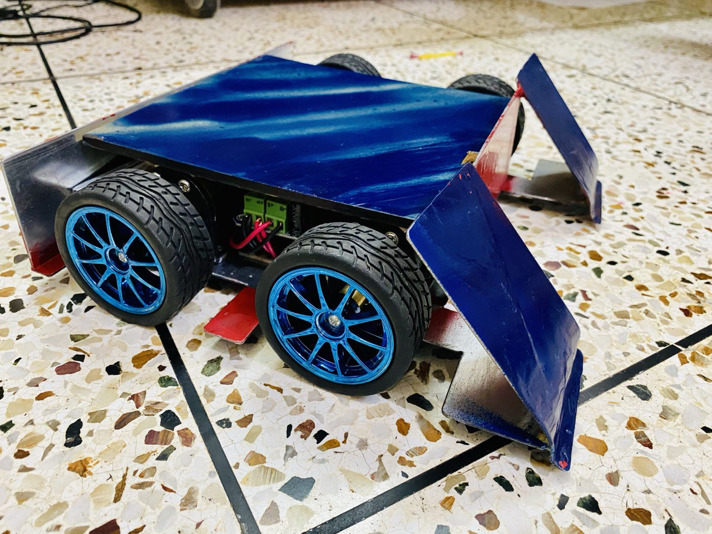
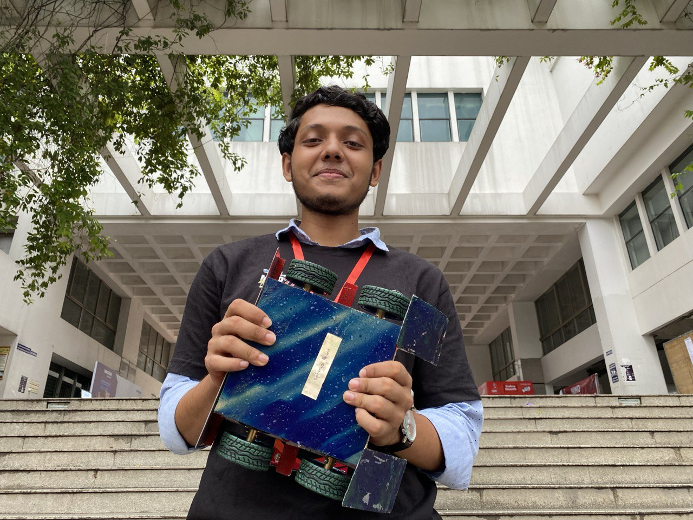
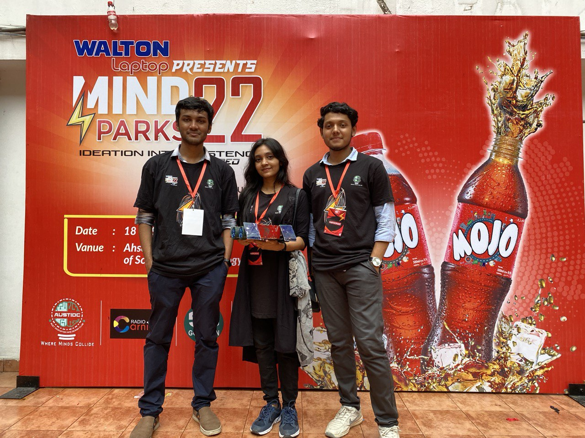

# Optimus Prime 2.0 

> *A high-performance rover with sophisticated RF control and precision maneuvering capabilities*



## Project Overview

Optimus Prime 2.0 is an advanced four-wheeled soccer robot designed for competitive robotics applications. This project represents a significant evolution in remote-controlled robotics, featuring dual-mode operation, precision steering algorithms, and robust hardware integration. Built on the Arduino platform with PlatformIO, it showcases professional-grade embedded systems development.

## Key Features & Capabilities

### **Dual-Mode Control System**
- **Mode A (Assisted/Locked)**: Precision control with automatic movement correction for accurate positioning
- **Mode B (Manual/Arcade)**: Full manual control with granular steering sensitivity across 12+ steering ranges
- **Seamless Mode Switching**: Real-time switching between control modes via CH6 switch

### **Advanced RF Communication**
- **FlySky FS-i6 Controller Integration**: Professional-grade 6-channel radio control
- **Multi-Channel Input Processing**: Simultaneous handling of 6 independent control channels
- **Failsafe Protection**: Automatic default positioning when signal is lost
- **Real-time Telemetry**: Live feedback of all control inputs via serial monitor

### **Precision Motor Control**
- **Four Independent Motor Channels**: Individual PWM control for each wheel
- **Variable Speed Control**: 0-255 PWM range with smooth acceleration curves
- **Differential Steering**: Advanced algorithms for tight radius turns and precise positioning
- **Dynamic Speed Mapping**: Intelligent speed reduction during turns to maintain control

### **Unique Steering Algorithm**
- **Multi-Range Steering Sensitivity**: 12 distinct steering ranges for ultra-precise control
- **Adaptive Speed Compensation**: Automatic outer wheel speed adjustment during turns
- **Minimum Speed Thresholds**: Prevents motor stalling while maintaining fine control
- **Bidirectional Control**: Full forward/reverse operation with identical steering precision

### **Robust Hardware Design**
- **Arduino Uno Platform**: Reliable ATmega328P microcontroller foundation
- **Efficient Power Management**: Optimized power distribution with protection circuits
- **Industrial-Grade Connections**: Secure wiring and robust connector systems
- **Modular Architecture**: Easy maintenance and future upgrades

## What Makes It Unique

1. **Hybrid Control Philosophy**: Unlike standard RC vehicles that offer either simple or complex control, Optimus Prime 2.0 provides both assisted and manual modes, allowing operators to choose the optimal control method for any situation.

2. **Granular Steering Control**: The 12-range steering system provides unprecedented precision, enabling micro-adjustments impossible with standard differential drive systems.

3. **Professional Development Standards**: Built using PlatformIO with proper project structure, version control, and embedded systems best practices.

4. **Soccer-Specific Optimizations**: Designed specifically for competitive soccer robotics with features like quick-action movements (CH5 pulse) and precision ball handling maneuvers.

5. **Scalable Architecture**: The modular code structure allows for easy addition of sensors, autonomous features, and advanced control algorithms.

## Technical Specifications

- **Microcontroller**: Arduino Uno (ATmega328P)
- **Development Environment**: PlatformIO
- **Communication**: FlySky FS-i6 6-channel 2.4GHz system
- **Motor Control**: 4x Independent PWM channels (10, 9, 5, 6)
- **Input Channels**: 6x Analog inputs (A0-A5)
- **Baud Rate**: 115200 for real-time telemetry
- **Control Frequency**: ~30ms pulse reading with timeout protection

## Project Structure

```
Optimus_Prime_2.0/
├── src/
│   └── main.cpp           # Core control algorithms and motor management
├── include/               # Header files and libraries
├── lib/                   # Custom libraries
├── test/                  # Unit tests and validation
├── images/               # Documentation images and media
├── platformio.ini        # PlatformIO configuration
└── README.md            # Project documentation
```

## Achievements & Recognition

Our Optimus Prime 2.0 competed the best rovers in Bangladesh in a Robosoccer frenzy in Mindsparks 2022 to achieve the **Semi-Finalist** title. Here are some snaps of me and my team:

<!--  -->


---

